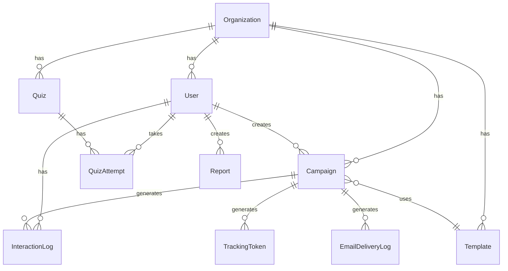

<](https://nodejs.org/)
[](https://reactjs.org/)
[](https://www.mongodb.com/)
[](https://expressjs.com/)
[](https://tailwindcss.com/)
[](LICENSE)

**An enterprise-grade platform to simulate phishing attacks, assess workforce vulnerability, gamify security awareness, and generate AI-driven risk insights.**

[Features](#-features) · [Quick Start](#-quick-start) · [Architecture](#-architecture) · [API Reference](#-api-reference) · [Deployment](#-deployment)

</div>

---

## 📋 Table of Contents

- [Overview](#-overview)
- [Features](#-features)
- [Tech Stack](#-tech-stack)
- [Architecture](#-architecture)
- [Prerequisites](#-prerequisites)
- [Quick Start](#-quick-start)
- [Environment Variables](#-environment-variables)
- [Database Models](#-database-models)
- [API Reference](#-api-reference)
- [User Roles & Permissions](#-user-roles--permissions)
- [Phishing Templates](#-phishing-templates)
- [AI Integration](#-ai-integration)
- [Deployment](#-deployment)
- [Project Structure](#-project-structure)
- [Screenshots](#-screenshots)
- [Contributing](#-contributing)
- [License](#-license)

---

## 🔍 Overview

**FinShield** is a full-stack cybersecurity simulation platform designed for organizations to proactively test and improve their employees' resilience against phishing and social engineering attacks. It operates strictly in a **defensive and ethical** manner — no real credentials or malicious payloads are ever stored.

### Problem Statement
Many organizations lack structured tools to safely simulate phishing and social engineering attacks. FinShield fills this gap by providing a secure, controlled environment to:

- Launch realistic phishing campaigns targeting specific departments or individuals
- Track employee interactions (email opens, link clicks, credential submissions)
- Measure organizational risk through real-time analytics dashboards
- Enhance security awareness through gamification, training, and AI-generated quizzes
- Generate comprehensive PDF reports for compliance and auditing

---

## ✨ Features

### 🎯 Phishing Campaign Engine
- Create, schedule, and auto-launch targeted phishing simulations
- Custom email subjects and bodies with template variable support (`{{name}}`, `{{department}}`, `{{link}}`)
- Department-level or individual user targeting
- Automated SMTP delivery via Nodemailer
- Campaign lifecycle management: `Draft → Scheduled → Running → Completed`
- Automated scheduler that checks and launches campaigns every 60 seconds

### 📊 Real-Time Analytics Dashboard
- Live-updating dashboard with 30-second auto-refresh
- Interactive charts powered by Recharts:
  - Phishing email interaction rates (bar chart)
  - Department risk timeline (line chart)
  - Attack type distribution (pie chart)
  - Campaign performance funnel
- Multi-filter support: department, campaign, user, and time range
- Overview KPIs: total users, campaigns, emails sent, click rate, report rate
- High-risk employee identification

### 🤖 AI-Powered Content Generation
- **Gemini AI** (Google) integration for:
  - Generating realistic phishing email content from admin prompts
  - Auto-generating cybersecurity quiz questions with explanations
  - Producing actionable security insights based on campaign data
- Smart prompt engineering to create emails with subtle red flags for training purposes

### 🔗 Link & Credential Tracking
- Unique UUID tracking tokens per user per campaign
- Email open tracking via invisible 1×1 pixel
- Link click tracking with redirect to phishing landing pages
- Form submission detection on landing pages
- Timestamped interaction logging for forensic analysis

### 🛡️ Employee Phishing Reporting
- Employees can report suspicious emails from their dashboard
- Smart identification via phishing link URL or email subject matching
- Automatic token extraction from pasted URLs
- Campaign-aware matching: reports are correlated to active simulations
- Points awarded for correct identification

### 🏆 Gamification & Leaderboard
- Point-based reward system:
  | Action | Points |
  |---|---|
  | Report phishing email | +10 |
  | Ignore phishing email | +5 |
  | Click phishing link | -5 |
  | Submit credentials | -10 |
- Three security levels: **Beginner** (0–20 pts) → **Aware** (21–50 pts) → **Security Champion** (51+ pts)
- Organization-wide leaderboard with department rankings
- Department-level aggregate scoring

### 📝 Template Management
- Pre-built phishing landing pages:
  - 🔐 **GitHub Fake Login** — Credential harvesting simulation
  - 📱 **Registration QR Code** — QR phishing simulation
  - 🖥️ **Nexus AI Login** — Product credential harvesting
  - 💰 **Salary Slip Download** — Malware download simulation
- Custom template creation with HTML/CSS/JS support
- Categorization: `Credential-Harvesting`, `QR-Phishing`, `Malware-Simulation`, `General`
- Difficulty levels: `Easy`, `Medium`, `Hard`

### 📋 User Reports Module
- Admin panel to view all incoming employee reports
- Search and filter by department, date range
- Simulation vs. Outsider toggle (identify if report matches a campaign)
- Detailed report cards with match status

### 👥 User & Organization Management
- Multi-tenant architecture with organization-scoped data isolation
- Organization registration with auto-generated unique codes
- Bulk user upload via CSV/Excel files
- Full CRUD operations on user records
- Profile management with organization code display

### 🎓 Training & Quizzes
- AI-generated cybersecurity awareness quizzes
- Department-targeted or individual-targeted quiz assignments
- Multiple-choice questions with explanations
- Progress tracking and attempt history
- Score-based point rewards

### 🔐 Role-Based Access Control (RBAC)
- JWT-based authentication with secure password hashing (bcrypt)
- Four distinct roles with tailored permissions (see [User Roles](#-user-roles--permissions))
- Protected routes on both frontend and backend
- Organization-scoped data access

### ✨ Modern UI/UX
- Glassmorphism design with frosted glass cards
- Dark/Light mode toggle
- Responsive layout optimized for all devices
- Micro-animations powered by Framer Motion
- Gradient accents and curated color palette
- Google Inter font for modern typography

### 📄 PDF Report Generation
- One-click comprehensive security report export
- Includes: overview metrics, interaction rates, funnel data, attack distribution, high-risk employees, department breakdown
- Professionally formatted with FinShield branding
- Auto-paginated multi-page documents

---

## 🛠️ Tech Stack

### Frontend
| Technology | Purpose |
|---|---|
| **React 18** | UI framework with hooks and context |
| **React Router v6** | Client-side routing with protected routes |
| **Tailwind CSS 3.4** | Utility-first styling framework |
| **Recharts** | Interactive data visualization charts |
| **Framer Motion** | Smooth page transition animations |
| **Lucide React** | Modern icon library |
| **Axios** | HTTP client for API communication |
| **jsPDF + AutoTable** | Client-side PDF report generation |

### Backend
| Technology | Purpose |
|---|---|
| **Node.js** | JavaScript runtime environment |
| **Express.js 4.18** | REST API framework |
| **MongoDB + Mongoose 8** | NoSQL database with ODM |
| **JWT (jsonwebtoken)** | Stateless authentication tokens |
| **bcryptjs** | Password hashing (12 salt rounds) |
| **Nodemailer** | SMTP email delivery service |
| **Google Generative AI** | Gemini AI integration for content generation |
| **Multer** | File upload middleware (CSV/Excel) |
| **xlsx** | Excel file parsing for bulk user upload |
| **csv-parser** | CSV file parsing |
| **uuid** | Unique tracking token generation |
| **ngrok** | Development tunneling for external access |

---

## 🏗️ Architecture

```
┌─────────────────────────────────────────────────────────────────┐
│                        CLIENT (React)                           │
│  ┌──────────┐  ┌──────────┐  ┌──────────┐  ┌──────────────┐   │
│  │ Auth     │  │ Campaign │  │Analytics │  │  Training/   │   │
│  │ Context  │  │ Pages    │  │Dashboard │  │  Quizzes     │   │
│  └────┬─────┘  └────┬─────┘  └────┬─────┘  └──────┬───────┘   │
│       │              │             │               │            │
│       └──────────────┴─────────────┴───────────────┘            │
│                          │ Axios                                │
│                          ▼                                      │
├─────────────────────────────────────────────────────────────────┤
│                    REST API (Express.js)                        │
│  ┌────────┐ ┌──────────┐ ┌──────────┐ ┌──────────┐            │
│  │ Auth   │ │Campaigns │ │Analytics │ │Templates │            │
│  │ Routes │ │ Routes   │ │ Routes   │ │ Routes   │            │
│  └───┬────┘ └────┬─────┘ └────┬─────┘ └────┬─────┘            │
│      │           │            │             │                   │
│  ┌───┴───────────┴────────────┴─────────────┴──────────┐       │
│  │              Middleware (JWT Auth + RBAC)             │       │
│  └──────────────────────┬──────────────────────────────┘       │
│                         │                                       │
│  ┌──────────────────────┴──────────────────────────────┐       │
│  │                   Services Layer                     │       │
│  │  ┌─────────┐ ┌─────────┐ ┌──────────┐ ┌─────────┐  │       │
│  │  │ Email   │ │ Gemini  │ │Scheduler │ │Gamific. │  │       │
│  │  │ Service │ │ AI Svc  │ │ Service  │ │ Service │  │       │
│  │  └─────────┘ └─────────┘ └──────────┘ └─────────┘  │       │
│  └─────────────────────────────────────────────────────┘       │
│                         │                                       │
├─────────────────────────┼───────────────────────────────────────┤
│                    MongoDB Atlas                                │
│  ┌──────┐ ┌────────┐ ┌──────────┐ ┌──────────┐ ┌──────┐      │
│  │Users │ │Campaign│ │Templates │ │Interaction│ │Quizzes│      │
│  └──────┘ └────────┘ └──────────┘ │   Logs    │ └──────┘      │
│  ┌──────┐ ┌────────┐ ┌──────────┐ └──────────┘ ┌──────┐      │
│  │Orgs  │ │Reports │ │Tracking  │ ┌──────────┐ │Audit │      │
│  │      │ │        │ │ Tokens   │ │Email Logs│ │ Logs │      │
│  └──────┘ └────────┘ └──────────┘ └──────────┘ └──────┘      │
└─────────────────────────────────────────────────────────────────┘
```

---

## 📦 Prerequisites

Before you begin, ensure you have the following installed:

- **Node.js** ≥ 18.x — [Download](https://nodejs.org/)
- **npm** ≥ 9.x (comes with Node.js)
- **MongoDB** — Local instance or [MongoDB Atlas](https://www.mongodb.com/cloud/atlas) (cloud)
- **Git** — [Download](https://git-scm.com/)

You will also need:
- **SMTP credentials** — For sending phishing simulation emails (e.g., Gmail App Password, Mailtrap, SendGrid)
- **Gemini API Key** *(optional)* — For AI-powered content generation ([Get API Key](https://aistudio.google.com/app/apikey))
- **ngrok Auth Token** *(optional)* — For development tunneling ([Get Token](https://ngrok.com/))

---

## 🚀 Quick Start

### 1. Clone the Repository

```bash
git clone https://github.com/rudrakunjadiya123/FinShield_Cyber_Simulator.git
cd FinShield_Cyber_Simulator
```

### 2. Install Dependencies

```bash
# Install all dependencies (backend + frontend)
npm run install-all
```

Or install separately:

```bash
# Backend
cd backend && npm install

# Frontend
cd ../frontend && npm install
```

### 3. Configure Environment Variables

Create `backend/.env`:

```env
# ─── Database ────────────────────────────────
MONGODB_URI=mongodb+srv://<username>:<password>@cluster.mongodb.net/finshield?retryWrites=true&w=majority

# ─── Authentication ──────────────────────────
JWT_SECRET=your_super_secret_jwt_key_here

# ─── SMTP Email Configuration ────────────────
SMTP_HOST=smtp.gmail.com
SMTP_PORT=587
SMTP_USER=your-email@gmail.com
SMTP_PASS=your-app-password

# ─── Server URLs ─────────────────────────────
BACKEND_URL=http://localhost:5000
FRONTEND_URL=http://localhost:3000
PORT=5000

# ─── AI (Optional) ───────────────────────────
GEMINI_API_KEY=your_gemini_api_key

# ─── ngrok (Optional, for dev tunneling) ─────
NGROK_AUTH_TOKEN=your_ngrok_auth_token
```

Create `frontend/.env`:

```env
REACT_APP_API_URL=http://localhost:5000/api
```

### 4. Seed the Database

```bash
npm run seed
```

This creates a demo environment with:

| Entity | Details |
|---|---|
| **Organization** | FinShield Demo Corp (Code: `DEMO1234`) |
| **Admin** | `admin@finshield.com` / `admin123` |
| **Cybersecurity** | `cyber@finshield.com` / `cyber123` |
| **Analyst** | `analyst@finshield.com` / `analyst123` |
| **Employees** | 25 users across 5 departments |
| **Templates** | 4 predefined + 2 custom phishing templates |

### 5. Start the Application

```bash
# Terminal 1: Start backend (port 5000)
npm run backend

# Terminal 2: Start frontend (port 3000)
npm run frontend
```

### 6. Open in Browser

Navigate to **http://localhost:3000** and log in with one of the seeded credentials.

---

## 🔑 Environment Variables

### Backend (`backend/.env`)

| Variable | Required | Description | Example |
|---|:---:|---|---|
| `MONGODB_URI` | ✅ | MongoDB connection string | `mongodb+srv://...` |
| `JWT_SECRET` | ✅ | Secret key for JWT token signing | `mySecretKey123` |
| `SMTP_HOST` | ✅ | SMTP server hostname | `smtp.gmail.com` |
| `SMTP_PORT` | ✅ | SMTP server port | `587` |
| `SMTP_USER` | ✅ | SMTP authentication email | `user@gmail.com` |
| `SMTP_PASS` | ✅ | SMTP authentication password / app password | `xxxx xxxx xxxx xxxx` |
| `BACKEND_URL` | ⚠️ | Backend server URL (used for tracking links) | `http://localhost:5000` |
| `FRONTEND_URL` | ⚠️ | Frontend URL (used for CORS) | `http://localhost:3000` |
| `PORT` | ❌ | Server port (default: 5000) | `5000` |
| `GEMINI_API_KEY` | ❌ | Google Gemini API key for AI features | `AIza...` |
| `NGROK_AUTH_TOKEN` | ❌ | ngrok token for dev tunneling | `2abc...` |

### Frontend (`frontend/.env`)

| Variable | Required | Description | Example |
|---|:---:|---|---|
| `REACT_APP_API_URL` | ⚠️ | Backend API base URL | `http://localhost:5000/api` |

---

## 🗄️ Database Models

### Entity Relationship Overview



### Model Schemas

<details>
<summary><b>👤 User</b></summary>

| Field | Type | Description |
|---|---|---|
| `name` | String | User's full name |
| `email` | String | Unique email address |
| `password` | String | Hashed password (bcrypt, 12 rounds) |
| `department` | String | Department assignment |
| `role` | Enum | `admin`, `cybersecurity`, `analyst`, `employee` |
| `organization_id` | ObjectId | Reference to Organization |
| `points` | Number | Gamification points (default: 0) |
| `security_level` | Enum | `Beginner`, `Aware`, `Security Champion` |

</details>

<details>
<summary><b>🏢 Organization</b></summary>

| Field | Type | Description |
|---|---|---|
| `name` | String | Organization name |
| `code` | String | Unique auto-generated join code |
| `industry` | String | Industry type |
| `size` | Enum | `1-50`, `51-200`, `201-500`, `501-1000`, `1000+` |
| `created_by` | ObjectId | Admin who created the org |
| `departments` | [String] | List of department names |

</details>

<details>
<summary><b>📧 Campaign</b></summary>

| Field | Type | Description |
|---|---|---|
| `name` | String | Campaign name |
| `email_subject` | String | Phishing email subject line |
| `email_body` | String | HTML email body with template variables |
| `template_id` | ObjectId | Landing page template reference |
| `target_departments` | [String] | Targeted department list |
| `target_emails` | [String] | Individual target emails |
| `launch_date` | Date | Scheduled launch date/time |
| `status` | Enum | `draft`, `scheduled`, `running`, `completed` |
| `created_by` | ObjectId | Creator reference |
| `organization_id` | ObjectId | Organization scope |

</details>

<details>
<summary><b>📄 Template</b></summary>

| Field | Type | Description |
|---|---|---|
| `template_name` | String | Display name |
| `description` | String | Template description |
| `phishing_link` | String | Template variable for tracking link |
| `html_code` | String | Full HTML/CSS/JS landing page code |
| `target_button_id` | String | ID of the CTA button element |
| `category` | String | `Credential-Harvesting`, `QR-Phishing`, `Malware-Simulation` |
| `is_predefined` | Boolean | System template flag |
| `difficulty_level` | Enum | `easy`, `medium`, `hard` |
| `ai_generated` | Boolean | AI-generated content flag |

</details>

<details>
<summary><b>📊 InteractionLog</b></summary>

| Field | Type | Description |
|---|---|---|
| `user_id` | ObjectId | Target user |
| `campaign_id` | ObjectId | Associated campaign |
| `email_opened` | Boolean | Whether the email was opened |
| `email_opened_at` | Date | Timestamp of email open |
| `link_clicked` | Boolean | Whether the phishing link was clicked |
| `link_clicked_at` | Date | Timestamp of link click |
| `reported_email` | Boolean | Whether the user reported the email |
| `reported_at` | Date | Timestamp of report |
| `form_submitted` | Boolean | Whether credentials were entered |
| `form_submitted_at` | Date | Timestamp of form submission |
| `tracking_token` | String | Unique token for this interaction |

</details>

<details>
<summary><b>🔑 TrackingToken</b></summary>

| Field | Type | Description |
|---|---|---|
| `token` | String | Unique UUID v4 token |
| `user_id` | ObjectId | Associated user |
| `campaign_id` | ObjectId | Associated campaign |
| `email_sent_time` | Date | When the email was sent |
| `clicked` | Boolean | Whether the link was clicked |
| `click_time` | Date | When the link was clicked |

</details>

<details>
<summary><b>🎓 Quiz / QuizAttempt</b></summary>

**Quiz:**
| Field | Type | Description |
|---|---|---|
| `title` | String | Quiz title |
| `prompt` | String | AI prompt used to generate questions |
| `target_departments` | [String] | Target departments |
| `target_emails` | [String] | Individual targets |
| `questions` | [Question] | Array of question objects |
| `is_active` | Boolean | Whether quiz is available |

**Question (embedded):**
| Field | Type | Description |
|---|---|---|
| `question` | String | Question text |
| `options` | [String] | 4 multiple-choice options |
| `correct_answer` | Number | 0-based index of correct option |
| `explanation` | String | Why the answer is correct |

</details>

<details>
<summary><b>📋 Report / AuditLog / EmailDeliveryLog</b></summary>

**Report:** Risk assessment reports with department-level risk scores and recommendations.

**AuditLog:** Tracks all admin/system actions (campaign launches, user modifications, etc.)

**EmailDeliveryLog:** SMTP delivery status tracking (`pending`, `sent`, `failed`) with error messages.

</details>

---

## 📡 API Reference

All endpoints are prefixed with `/api`. Authentication requires a Bearer token in the `Authorization` header.

### Authentication
| Method | Endpoint | Description | Auth |
|---|---|---|:---:|
| `POST` | `/api/auth/register` | Register new user + organization | ❌ |
| `POST` | `/api/auth/login` | Login and receive JWT token | ❌ |
| `GET` | `/api/auth/me` | Get current user profile | ✅ |

### Campaigns
| Method | Endpoint | Description | Roles |
|---|---|---|---|
| `GET` | `/api/campaigns` | List all campaigns | Admin |
| `POST` | `/api/campaigns` | Create new campaign | Admin |
| `GET` | `/api/campaigns/:id` | Get campaign details | Admin, Cyber, Analyst |
| `POST` | `/api/campaigns/:id/launch` | Launch a campaign | Admin |
| `PUT` | `/api/campaigns/:id/status` | Update campaign status | Admin |

### Templates
| Method | Endpoint | Description | Roles |
|---|---|---|---|
| `GET` | `/api/templates` | List all templates | Admin, Cyber |
| `POST` | `/api/templates` | Create new template | Admin, Cyber |
| `PUT` | `/api/templates/:id` | Update template | Admin, Cyber |
| `DELETE` | `/api/templates/:id` | Delete template | Admin, Cyber |

### Users
| Method | Endpoint | Description | Roles |
|---|---|---|---|
| `GET` | `/api/users` | List all users | Admin |
| `POST` | `/api/users/upload` | Bulk upload via CSV/Excel | Admin |
| `PUT` | `/api/users/:id` | Update user | Admin |
| `DELETE` | `/api/users/:id` | Delete user | Admin |

### Analytics
| Method | Endpoint | Description | Roles |
|---|---|---|---|
| `GET` | `/api/analytics/dashboard-v2` | Full dashboard data with filters | Admin, Cyber, Analyst |
| `GET` | `/api/analytics/filters` | Available filter options | Admin, Cyber, Analyst |
| `GET` | `/api/analytics/insights` | AI-generated security insights | Admin, Cyber, Analyst |
| `GET` | `/api/analytics/my-stats` | Employee personal stats | Employee |
| `POST` | `/api/analytics/employee/report-phishing` | Report suspicious email | Employee |

### Tracking (No Auth — accessed via email links)
| Method | Endpoint | Description |
|---|---|---|
| `GET` | `/api/track/click/:token` | Track link click + redirect to landing page |
| `GET` | `/api/track/open/:token` | Track email open (1×1 pixel) |
| `POST` | `/api/track/submit/:token` | Track form/credential submission |

### Gamification
| Method | Endpoint | Description | Roles |
|---|---|---|---|
| `GET` | `/api/gamification/leaderboard` | Get leaderboard rankings | All |
| `GET` | `/api/gamification/departments` | Department rankings | All |

### Quizzes
| Method | Endpoint | Description | Roles |
|---|---|---|---|
| `GET` | `/api/quiz` | List available quizzes | All |
| `POST` | `/api/quiz` | Create quiz (AI-generated) | Admin, Cyber |
| `POST` | `/api/quiz/:id/attempt` | Submit quiz attempt | Employee |

### Reports & Audit
| Method | Endpoint | Description | Roles |
|---|---|---|---|
| `GET` | `/api/reports` | List employee reports | Admin, Cyber |
| `GET` | `/api/audit` | View audit logs | Admin |

### Health Check
| Method | Endpoint | Description |
|---|---|---|
| `GET` | `/api/health` | Server health check |
| `GET` | `/` | API server info |

---

## 👥 User Roles & Permissions

| Feature | 👑 Admin | 🔒 Cybersecurity | 📈 Analyst | 🧑‍💻 Employee |
|---|:---:|:---:|:---:|:---:|
| Analytics Dashboard | ✅ | ✅ | ✅ | ❌ |
| Employee Dashboard | ❌ | ❌ | ❌ | ✅ |
| Create/Launch Campaigns | ✅ | ❌ | ❌ | ❌ |
| View Campaign Details | ✅ | ✅ | ✅ | ❌ |
| Manage Templates | ✅ | ✅ | ❌ | ❌ |
| Manage Users | ✅ | ❌ | ❌ | ❌ |
| View Employee Reports | ✅ | ✅ | ❌ | ❌ |
| Report Phishing | ❌ | ❌ | ❌ | ✅ |
| Training & Quizzes | ✅ | ✅ | ❌ | ✅ |
| Leaderboard | ✅ | ✅ | ✅ | ✅ |
| Profile Management | ✅ | ✅ | ✅ | ✅ |
| PDF Report Generation | ✅ | ✅ | ✅ | ❌ |

---

## 🎭 Phishing Templates

FinShield ships with 4 pre-built, realistic phishing landing pages:

| Template | Category | Difficulty | Description |
|---|---|:---:|---|
| **Registration QR Code** | QR-Phishing | 🟡 Medium | Fake registration page with QR code payment scam |
| **GitHub Fake Login** | Credential-Harvesting | 🔴 Hard | Replica of GitHub login for credential theft |
| **Nexus AI Login** | Credential-Harvesting | 🟡 Medium | Fake AI product login page |
| **Salary Slip Download** | Malware-Simulation | 🟢 Easy | Fake salary slip download portal |

### Template Variables

Templates support these dynamic placeholders:

| Variable | Replaced With |
|---|---|
| `{{name}}` | Target employee's full name |
| `{{department}}` | Target employee's department |
| `{{link}}` | Unique tracking URL for the campaign |

---

## 🤖 AI Integration

FinShield uses **Google Gemini AI** (`gemini-2.5-flash`) for intelligent content generation:

### Email Content Generation
Admins can describe a phishing scenario in plain language, and Gemini generates a realistic email with:
- Professional subject line
- HTML-formatted email body
- Appropriate template variable usage
- Subtle red flags for training purposes

### Quiz Generation
Describe a cybersecurity topic, and Gemini creates:
- Multiple-choice questions with 4 options each
- Correct answer identification
- Educational explanations for each answer
- Varied difficulty levels

### Security Insights
The AI analyzes campaign data to generate:
- Vulnerability trend identification
- Department risk assessments
- Actionable recommendations
- Behavioral pattern analysis

> **Note:** AI features require a valid `GEMINI_API_KEY` in your environment variables. The system gracefully handles API rate limits (429 errors) with user-friendly messages.

---

## 🚢 Deployment

### Frontend (Vercel)

1. Push your code to GitHub
2. Connect your repository to [Vercel](https://vercel.com)
3. Set the root directory to `frontend`
4. Add environment variable:
   ```
   REACT_APP_API_URL=https://your-backend-url.onrender.com/api
   ```
5. Deploy

### Backend (Render)

1. Create a new **Web Service** on [Render](https://render.com)
2. Connect your GitHub repository
3. Configure:
   - **Root Directory:** `backend`
   - **Build Command:** `npm install`
   - **Start Command:** `npm start`
4. Add all environment variables from the [Environment Variables](#-environment-variables) section
5. Ensure `BACKEND_URL` is set to your Render service URL
6. Ensure `FRONTEND_URL` is set to your Vercel deployment URL

### Important Deployment Notes

- Update CORS origins in `server.js` to match your deployed URLs
- Set `BACKEND_URL` to your Render service URL (used for tracking link generation)
- Ensure MongoDB Atlas allows connections from Render's IP addresses (or use `0.0.0.0/0` for dev)
- For SMTP, use app-specific passwords (not regular account passwords)

---

## 📁 Project Structure

```
FinShield/
├── 📄 package.json                 # Root scripts (install-all, seed, tunnel)
├── 📄 .gitignore                   # Git ignore rules
│
├── 📂 backend/
│   ├── 📄 server.js                # Express app entry point
│   ├── 📄 seed.js                  # Database seeder script
│   ├── 📄 package.json             # Backend dependencies
│   ├── 📄 start_tunnel.js          # ngrok tunnel utility
│   │
│   ├── 📂 config/
│   │   └── 📄 db.js                # MongoDB connection setup
│   │
│   ├── 📂 middleware/
│   │   └── 📄 auth.js              # JWT auth + RBAC middleware
│   │
│   ├── 📂 models/
│   │   ├── 📄 User.js              # User schema with password hashing
│   │   ├── 📄 Organization.js      # Multi-tenant organization model
│   │   ├── 📄 Campaign.js          # Phishing campaign schema
│   │   ├── 📄 Template.js          # Phishing template schema
│   │   ├── 📄 InteractionLog.js    # User interaction tracking
│   │   ├── 📄 TrackingToken.js     # Unique per-user tracking tokens
│   │   ├── 📄 EmailDeliveryLog.js  # SMTP delivery status
│   │   ├── 📄 Quiz.js              # Quiz with embedded questions
│   │   ├── 📄 QuizAttempt.js       # Quiz attempt records
│   │   ├── 📄 Report.js            # Risk assessment reports
│   │   └── 📄 AuditLog.js          # System audit trail
│   │
│   ├── 📂 routes/
│   │   ├── 📄 auth.js              # Authentication endpoints
│   │   ├── 📄 campaigns.js         # Campaign CRUD + launch
│   │   ├── 📄 templates.js         # Template management
│   │   ├── 📄 users.js             # User management + bulk upload
│   │   ├── 📄 tracking.js          # Click/open/submit tracking
│   │   ├── 📄 analytics.js         # Dashboard + insights + reporting
│   │   ├── 📄 gamification.js      # Leaderboard + points
│   │   ├── 📄 quiz.js              # Quiz CRUD + attempts
│   │   ├── 📄 reports.js           # Employee reports management
│   │   └── 📄 audit.js             # Audit log retrieval
│   │
│   ├── 📂 services/
│   │   ├── 📄 emailService.js      # Nodemailer SMTP service
│   │   ├── 📄 geminiService.js     # Google Gemini AI integration
│   │   ├── 📄 aiService.js         # AI insight generation
│   │   ├── 📄 gamificationService.js # Points + leaderboard logic
│   │   ├── 📄 schedulerService.js  # Auto-launch campaign scheduler
│   │   ├── 📄 templateService.js   # Template rendering service
│   │   └── 📄 auditService.js      # Audit logging helper
│   │
│   ├── 📂 templates/               # Phishing landing page HTML files
│   │   ├── 📄 Github_Fake_Login.html
│   │   ├── 📄 Product_Fake_Index.html
│   │   ├── 📄 Registration_QR.html
│   │   └── 📄 Salary_Slip_Fake.html
│   │
│   └── 📂 uploads/                 # Temporary file upload directory
│
└── 📂 frontend/
    ├── 📄 package.json              # Frontend dependencies
    ├── 📄 tailwind.config.js        # Tailwind CSS configuration
    ├── 📄 postcss.config.js         # PostCSS configuration
    │
    ├── 📂 public/                   # Static assets
    │
    └── 📂 src/
        ├── 📄 App.js                # Root component with routing
        ├── 📄 index.js              # React entry point
        ├── 📄 index.css             # Global styles + glassmorphism
        │
        ├── 📂 components/
        │   ├── 📄 Navbar.js         # Navigation bar with role-based links
        │   ├── 📄 ProtectedRoute.js # Route guard with role checking
        │   └── 📄 MultiSelectDropdown.js # Reusable dropdown component
        │
        ├── 📂 context/
        │   ├── 📄 AuthContext.js    # JWT auth state management
        │   └── 📄 ThemeContext.js   # Dark/Light mode toggle
        │
        ├── 📂 pages/
        │   ├── 📄 LandingPage.js    # Public marketing page
        │   ├── 📄 LoginPage.js      # Login form
        │   ├── 📄 RegisterPage.js   # Registration + org creation/join
        │   ├── 📄 DashboardPage.js  # Admin + Employee dashboards
        │   ├── 📄 AnalyticsDashboard.js # Extended analytics section
        │   ├── 📄 CampaignPage.js   # Campaign list + creation
        │   ├── 📄 CampaignDetailPage.js # Individual campaign stats
        │   ├── 📄 TemplatePage.js   # Template management
        │   ├── 📄 UserUploadPage.js # User management + bulk upload
        │   ├── 📄 EmployeeReportsPage.js # Admin reports viewer
        │   ├── 📄 TrainingPage.js   # Training modules + quizzes
        │   ├── 📄 LeaderboardPage.js # Gamification leaderboard
        │   ├── 📄 PhishingDrillPage.js # Phishing landing page renderer
        │   ├── 📄 ProfilePage.js    # User profile management
        │   └── 📄 ReportPage.js     # Report detail viewer
        │
        └── 📂 services/
            └── 📄 api.js            # Axios instance with auth interceptor
```

---

## 📸 Screenshots

> 📌 *Screenshots coming soon — Run the project locally to explore the full UI!*

Expected screens include:
- 🏠 **Landing Page** — Modern hero section with glassmorphism preview
- 📊 **Admin Dashboard** — KPI cards, interactive charts, AI insights
- 📧 **Campaign Builder** — AI-assisted email creation + scheduling
- 🏆 **Leaderboard** — Gamified rankings with security levels
- 📱 **Employee Dashboard** — Personal security stats + phishing reporting
- 🎓 **Training Page** — Interactive quizzes with AI-generated questions

---

## 🤝 Contributing

Contributions are welcome! To get started:

1. **Fork** the repository
2. **Create** a feature branch: `git checkout -b feature/amazing-feature`
3. **Commit** your changes: `git commit -m 'Add amazing feature'`
4. **Push** to the branch: `git push origin feature/amazing-feature`
5. **Open** a Pull Request

### Development Guidelines

- Follow existing code patterns and folder structure
- Use meaningful commit messages
- Test all features before submitting PRs
- Ensure RBAC permissions are correctly enforced
- Keep API endpoints RESTful and consistent

---

## 📄 License

This project is licensed under the **MIT License** — see the [LICENSE](LICENSE) file for details.

---

## 🙏 Acknowledgements

- [React](https://reactjs.org/) — Frontend framework
- [Express.js](https://expressjs.com/) — Backend API framework
- [MongoDB](https://www.mongodb.com/) — Database
- [Tailwind CSS](https://tailwindcss.com/) — Styling framework
- [Recharts](https://recharts.org/) — Data visualization
- [Framer Motion](https://www.framer.com/motion/) — Animations
- [Google Gemini AI](https://ai.google.dev/) — AI content generation
- [Lucide Icons](https://lucide.dev/) — Icon library
- [Nodemailer](https://nodemailer.com/) — Email delivery

---

<div align="center">

**Built with ❤️ for cybersecurity awareness**

🛡️ *FinShield — Strengthening your human firewall, one simulation at a time.*

</div>
]]>
